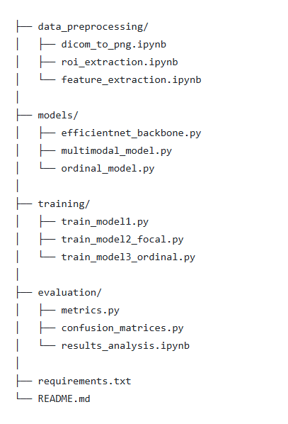

Automatic Classification of Carotid Artery Stenosis from Ultrasound Images

This repository contains the code developed for the Research and Development Project in Computer Engineering with Industry (10 ECTS) at Aarhus University.
The project investigates the feasibility of deep learning–based classification of carotid artery stenosis using static Doppler ultrasound screenshots under realistic clinical constraints

# Automatic Classification of Carotid Artery Stenosis from Ultrasound Images

This repository contains the code developed for the **Research and Development Project in Computer Engineering with Industry (10 ECTS)** at **Aarhus University**.  
The project investigates the feasibility of deep learning–based classification of carotid artery stenosis using **static Doppler ultrasound screenshots** under realistic clinical constraints.

---

## 📌 Project Overview

Carotid artery stenosis is a major risk factor for ischemic stroke. In many real-world clinical environments, only static ultrasound screenshots are available instead of raw DICOM data or Doppler video sequences.

This project explores whether deep learning models can learn clinically meaningful stenosis-related patterns from such constrained data. The work is intended as a **proof of concept** and is not a clinically deployable system.

---

## 🏗️ Repository Structure

The following figure illustrates the organization of the repository and the main components of the implementation.

<p align="center">
  
</p>

---

## 🧠 Models Implemented

- **Model 1:** Multimodal three-class classification with class-weighted cross-entropy  
- **Model 2:** Multimodal three-class classification with focal loss and freeze–unfreeze fine-tuning  
- **Model 3:** Ordinal multimodal learning with two-logit ordinal head enforcing severity ordering  

All models use **EfficientNet-B0** as the image backbone and combine Doppler ROI images with tabular Doppler features.

---

## 🖼️ Data Availability

🚫 **The ultrasound dataset is not publicly available.**

Due to clinical privacy and data protection constraints, the ultrasound images and corresponding annotations cannot be shared. This repository therefore focuses on model architectures, training pipelines, and evaluation methodology.

---

## ⚙️ Requirements

The code is implemented in **Python 3.12** using **PyTorch**.

Install dependencies with:numpy==1.26.4
pandas==2.2.2
matplotlib==3.8.4
seaborn==0.13.2
scikit-learn==1.4.2
scikit-image==0.23.2
torch==2.2.2
torchvision==0.17.2
tqdm==4.66.4
Pillow==10.3.0
opencv-python==4.9.0.80
easyocr==1.7.1


```bash
pip install -r requirements.txt


